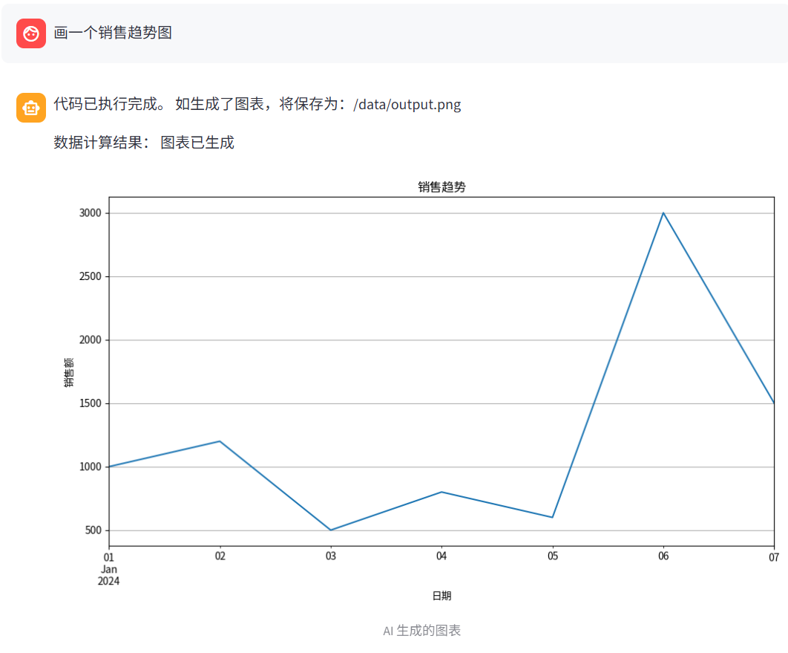
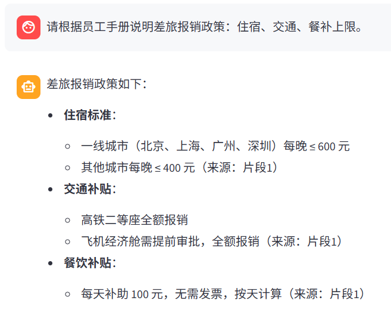
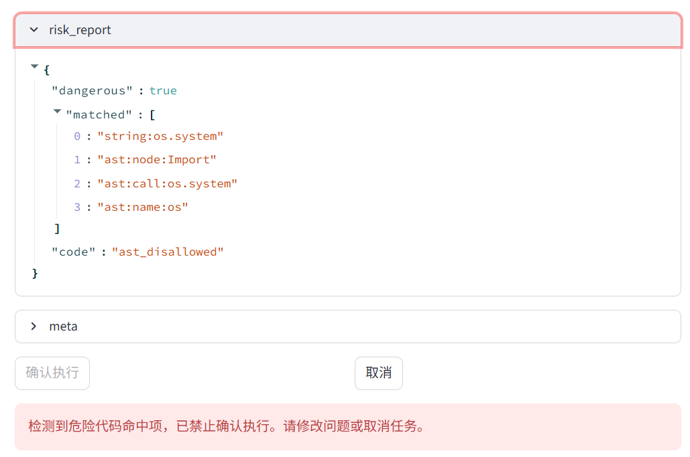

# 多智能体 AI 助手（Agent / RAG / HITL 安全执行）

一个可运行、可回归、可观测的 LLM 应用工程项目：支持多智能体路由、数据分析出图、政策问答（带证据引用）、以及执行前安全确认。

## 快速验证

```bash
cd AI_Intern_Bootcamp
docker compose up --build
```

打开 http://localhost:8501
依次提问：

1. 画一个销售额趋势图
2. 请根据员工手册说明差旅报销政策：住宿、交通、餐补上限。
3. `[SECURITY_TEST] generate dangerous code`（需开启 `ENABLE_SECURITY_TEST=1`；不开也不影响核心功能）

## 功能概览

- **Router**：将请求路由到 Analyst / Expert / General
- **Analyst**：数据分析 + 画图（执行前 Human-in-the-loop 确认）
- **Expert**：RAG 政策问答（证据不足拒答 + 强制引用片段）
- **General**：闲聊/使用说明

## 项目结构

- `data_agent_app.py`：Streamlit 前端（消息展示、pending 预览、确认按钮、图片展示）
- `server.py`：FastAPI 后端（/chat、/confirm、静态文件、events 落盘）
- `multi_agent_graph.py`：LangGraph 编排（router/analyst/expert/general）
- `rag_tool.py` / `refusal_rules.py` / `rag_app.py`：RAG 检索与拒答门控
- `run_eval*.py` / `eval_cases.json`：回归评测（离线/本地/端到端）
- `trace_events.py`：blocked 配对追踪（/chat pending → /confirm）

## 截图

1. **数据分析出图（Analyst）**
   

2. **政策问答可追溯（Expert：回答标注“来源：片段X”）**
   

3. **执行安全门禁（HITL：危险代码确认阶段被拦截）**
   

## 关键特性

- **HITL 两段式执行**：`/chat` 仅生成 pending 代码预览与风险报告，`/confirm` 才执行
- **双层安全门**：前端禁用确认 + 后端 403 强拦截（dangerous_code / ast_disallowed）
- **RAG 拒答门控**：主题覆盖 + 分数阈值 + 缺字段检测，证据不足统一拒答
- **回答可追溯**：政策回答每个要点标注“来源：片段X”
- **回归评测**：离线/本地/端到端三种模式，产出 `eval_summary` / `eval_report`
- **可观测性**：`api_events.jsonl` 落盘 + `events_summary` 汇总 + blocked trace 一键定位

## 运行方式（Docker）

```bash
cd AI_Intern_Bootcamp
docker compose up --build
```

- 后端 API：http://localhost:8000
- 前端 Web：http://localhost:8501

## Demo

- **数据分析画图**：画一个销售额趋势图
- **追问数值**：哪天销售额最高？直接给出日期和金额，不要画图。
- **政策问答（带引用）**：请根据员工手册说明差旅报销政策：住宿、交通、餐补上限。
- **拒答示例**：公司绩效考核分几档？A/B/C 的定义是什么？

## 回归评测

**离线检查（不走模型）：**
```bash
python -u AI_Intern_Bootcamp/run_eval_offline.py
```

**本地回归（直接调用 Graph）：**
```bash
python -u AI_Intern_Bootcamp/run_eval_local.py
```

**端到端回归（走 HTTP /chat + 自动 /confirm）：**
```bash
python -u AI_Intern_Bootcamp/run_eval.py --auto-server --timeout 240
```
产物：`eval_summary.json` / `eval_report.json` / `eval_failures.json`

## 可观测性与排障

- 事件落盘：`api_events.jsonl`
- 汇总接口：`GET /static/events_summary.json`
- blocked 根因追踪（/chat pending → /confirm）：
  ```bash
  python -u AI_Intern_Bootcamp/trace_events.py --input AI_Intern_Bootcamp/api_events.jsonl --blocked-only --output blocked_traces.json
  ```

## 安全设计（简述）

- `/chat` 返回 pending + task_id + code + risk_report 供审阅
- `/confirm` 是唯一执行入口：危险命中返回 403 并记录 block_reason

---

## 90 秒自我介绍稿（AI 应用工程 / 杭州）

我叫曹紫阳，是集美大学诚毅学院数据科学与大数据技术专业，2026 年 6 月毕业。我主攻 AI 应用工程方向，重点做 Agent/RAG 的工程化落地。

我做了一个多智能体 AI 助手项目：前端 Streamlit，后端 FastAPI 提供 `/chat` 和 `/confirm`，内部用 LangGraph 编排 Router/Analyst/Expert 三条路径。Analyst 负责数据分析和画图，我把它做成两段式执行：第一次 `/chat` 只返回 pending 代码预览、task_id 和风险报告，用户确认后才走 `/confirm` 执行；同时做了前端禁用确认和后端 403 强拦截，覆盖字符串规则和 AST 规则两类风险，保证危险代码不会被执行并且可审计。

Expert 负责政策问答，我把 RAG 做成“证据不足就拒答”的三道门：主题覆盖、分数阈值、缺字段检测，并且最终回答强制标注引用片段编号，减少幻觉。工程上我建立了离线/本地/端到端三种回归评测，评测产物可复现；同时把请求事件落盘并汇总，写了 trace 脚本按 `thread_id` 把 `/chat` pending 和 `/confirm` 配对，能快速定位 blocked 的根因。

我希望在杭州找 AI 应用工程师/LLM 应用工程师岗位，愿意从外包/小厂/初创做起，快速成长并持续迭代作品。
